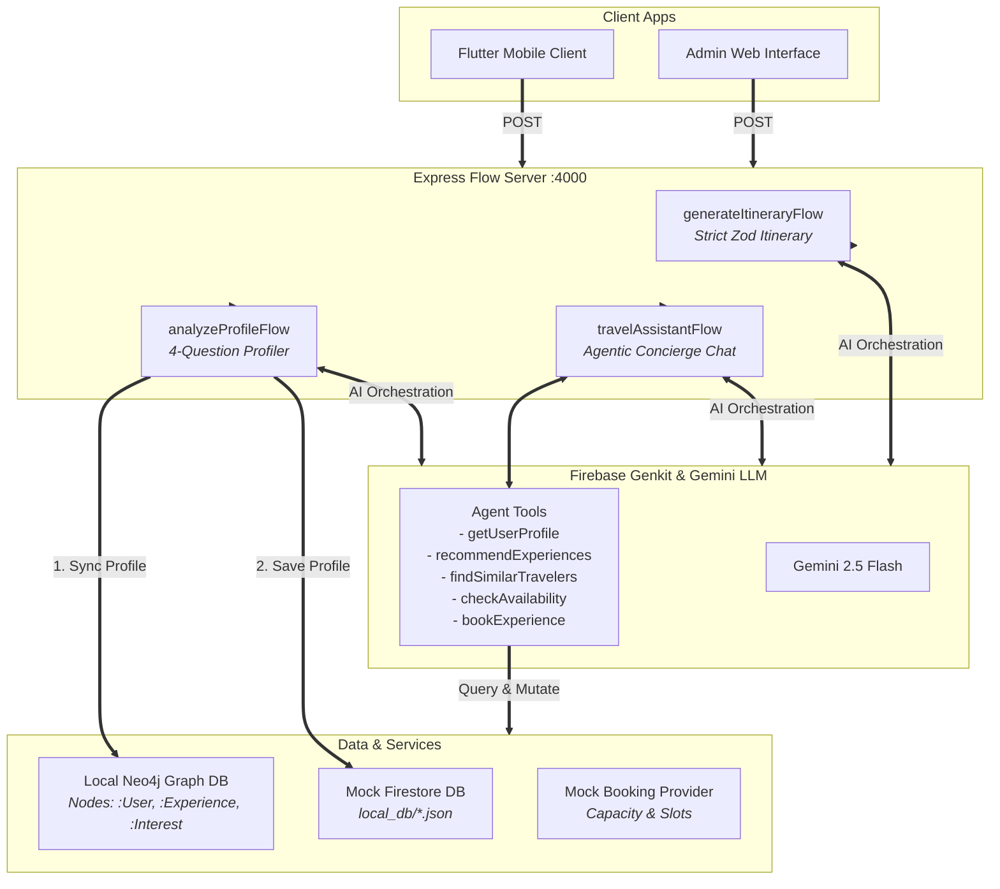

<p align="center">
  
</p>

<p align="center">
  
  
  
  
  
</p>

---

# 🧠 TravelAnatolia (Agentic-Core Backend)

> **The intelligent, autonomous multi-agent brain behind TravelAnatolia.** A high-performance travel coordination API powered by Firebase Genkit and Google Gemini. Agentic-Core utilizes local Neo4j graph databases for real-time social/itinerary overlaps, maintains a capacity-controlled mock reservation system, and provides offline self-healing capabilities for seamless client development.

---

## ✨ System Architecture



---

## 🌟 Core Pillars & Capabilities

1.  **Interactive Traveler Onboarding (`analyzeProfileFlow`):** Parses user survey responses via Gemini to extract structured traveler personas, preferred travel styles, and cataloged interests.
2.  **Global Graph Integration (Neo4j):** Interlocks `:User`, `:Experience`, `:Interest`, and `:Location` nodes. Suggests hyper-personalized tours and connects travelers sharing the same paths.
3.  **Autonomous Conversational Concierge (ANA):** A multi-turn chat agent powered by Gemini tool-calling, executing real-time catalog checking, reservation searches, and automated bookings.
4.  **Local File-Backed Firestore Database:** Eliminates remote cloud dependencies by maintaining collection states locally in elegant, human-readable JSON files (`local_db/`).
5.  **Self-Healing Fallback AI Engine:** Gracefully functions in offline environments or without active Gemini API keys by automatically serving simulated responses without crashing.

---

## 🕸️ Neo4j Graph Layout & Smart Matching

Agentic-Core uses a highly optimized graph structure to discover similar travel styles and coordinate shared experiences.

```
  (:User) --------[:HAS_INTEREST]--------> (:Interest) <--------[:HAS_TAG]-------- (:Experience)
                             \                                     /
                    [:LOCATED_IN]                           [:LOCATED_IN]
                             v                                     v
                                       (:Location)
```

### 🔮 Personalized Recommendation Engine
Queries experiences sharing the highest count of overlapping interest tags with the traveler:
```cypher
MATCH (u:User {userId: $userId})-[:HAS_INTEREST]->(i:Interest)<-[:HAS_TAG]-(e:Experience)
RETURN e.id AS id, e.name AS name, e.category AS category, e.location AS location, e.priceUSD AS priceUSD, count(i) AS score
ORDER BY score DESC, e.priceUSD DESC
LIMIT 5
```

### 🤝 Social Companion matching
Locates compatible travel companions on similar routes who share 2 or more interests:
```cypher
MATCH (u:User {userId: $userId})-[:HAS_INTEREST]->(i:Interest)<-[:HAS_INTEREST]->(other:User)
WHERE u.userId <> other.userId
WITH other, count(i) AS sharedCount, collect(i.name) AS sharedInterests
WHERE sharedCount >= 2
RETURN other.userId AS userId, other.fullName AS fullName, other.travelStyle AS travelStyle, sharedCount, sharedInterests
ORDER BY sharedCount DESC
LIMIT 5
```

---

## 🛠️ REST Endpoints & Schemas

The Express server boots on port **`4000`** and handles input/output payloads wrapped inside standard Genkit `{ "data": ... }` structures.

### 1️⃣ Onboarding Profile Analyzer (`/analyzeProfileFlow`)
*   **Request URL:** `POST http://localhost:4000/analyzeProfileFlow`
*   **Payload Schema (`OnboardingAnswersSchema`):**
    ```typescript
    {
      userId: string,
      fullName: string,
      travelStyle: string,  // Favorite travel style response
      budget: string,       // Typical daily budget response
      companion: string,    // Typical travel companion response
      activities: string    // 3-5 specific activities or interests response
    }
    ```
*   **Response Schema (`TravelerProfile`):**
    ```typescript
    {
      userId: string,
      fullName: string,
      travelStyle: "Adventure" | "History" | "Culinary" | "Relaxation" | "Other",
      budgetRange: "Budget" | "Moderate" | "Luxury",
      companion: "Solo" | "Partner" | "Family" | "Friends",
      interests: string[], // Cleaned lowercase interest tags
      personaDescription: string, // Personalized 2-3 sentence overview
      createdAt: string
    }
    ```

### 2️⃣ Persistent Chat Concierge (`/travelAssistantFlow`)
*   **Request URL:** `POST http://localhost:4000/travelAssistantFlow`
*   **Payload Schema (`ChatInputSchema`):**
    ```typescript
    {
      userId: string,
      sessionId: string,
      message: string
    }
    ```
*   **Response Schema (`ChatOutputSchema`):**
    ```typescript
    {
      responseMessage: string,      // Rich textual reply from the agent (ANA)
      chatHistory: ChatMessage[]    // Full, updated chat logs (roles: "user", "model", "tool")
    }
    ```

---

## 🚀 Getting Started

Follow these instructions to run the development server locally.

### Prerequisites

*   [Node.js](https://nodejs.org/) v22 or higher
*   [Docker Desktop](https://www.docker.com/) (to run Neo4j in a single command)

### 1. Install Dependencies
```bash
npm install
```

### 2. Configure Environment Variables
Create a `.env` file at the root of the project using the `.env.example` template:
```env
# Optional: Google AI Studio API Key (Leave empty to trigger self-healing Mock AI Mode)
GOOGLE_GENAI_API_KEY="your_actual_gemini_api_key"

# Neo4j Graph Database Authentication
NEO4J_URI="bolt://localhost:7687"
NEO4J_USER="neo4j"
NEO4J_PASSWORD="password123"
```

### 3. Spin up Neo4j Graph DB
Launch a configured Neo4j community instance using Docker:
```bash
docker run -d --name neo4j-travel -p 7474:7474 -p 7687:7687 -e NEO4J_AUTH=neo4j/password123 neo4j:latest
```

### 4. Seed the Experience Catalog & Graph
Populate the local JSON databases and synchronize all Neo4j relationship maps:
```bash
npx tsx src/seed.ts
```

### 5. Launch the Genkit Developer UI
Start the local server and active developer environment:
```bash
npm run dev
```
The server will bind to `http://localhost:4000` and launch the interactive Genkit Developer console.

### 6. Run Automated Verification Suite
To execute an end-to-end simulation of profile registration, graph matching, and reservation booking in isolation, run:
```bash
npx tsx src/verify.ts
```

---

## 🧪 Quick Test cURL Examples

### Test Profile Creation
```bash
curl -X POST http://localhost:4000/analyzeProfileFlow \
  -H "Content-Type: application/json" \
  -d '{
    "data": {
      "userId": "user_david",
      "fullName": "David Beckham",
      "travelStyle": "Active hiking, ballooning, premium dining",
      "budget": "High luxury budget",
      "companion": "Solo traveler",
      "activities": "hiking, ballooning, fine dining, history"
    }
  }'
```

---

## 📂 File Directory

```
Agentic-Core/
├── local_db/              # Stateful local JSON tables (git-ignored)
│   ├── profiles.json      # Onboarded traveler personas
│   ├── experiences.json   # Pluggable experience catalog
│   ├── sessions.json      # Persistent multi-turn chat sessions
│   └── bookings.json      # Completed reservations
├── src/
│   ├── index.ts           # Flow Server setup & Express bootstrap
│   ├── ai.ts              # Firebase Genkit and Gemini setup
│   ├── types.ts           # Shared schemas and Zod definitions
│   ├── firestoreMock.ts   # File-backed local document manager
│   ├── neo4j.ts           # Neo4j Driver client connection
│   ├── graphSync.ts       # Neo4j graph nodes synchronization
│   ├── graphQueries.ts    # Cypher recommendation & social matching logic
│   ├── onboarding.ts      # Profile parsing Genkit flow
│   ├── mockProvider.ts    # Booking slots capacity manager
│   ├── agent.ts           # Multi-turn chat assistant flow & tool registry
│   ├── seed.ts            # Experience catalog seeder
│   └── verify.ts          # End-to-end programmatic verification suite
├── package.json           # Scripts and core dependencies
├── tsconfig.json          # TypeScript compile configurations
└── README.md              # Project documentation
```

---

## 📄 License

This software is a private proprietary project. All rights are strictly reserved. No part of this repository may be reproduced, distributed, or transmitted in any form without the prior written permission of **Erdem Metin**.

<p align="center" style="margin-top: 40px;">
  Built with 🧠 & 🧡 for TravelAnatolia V2
</p>
