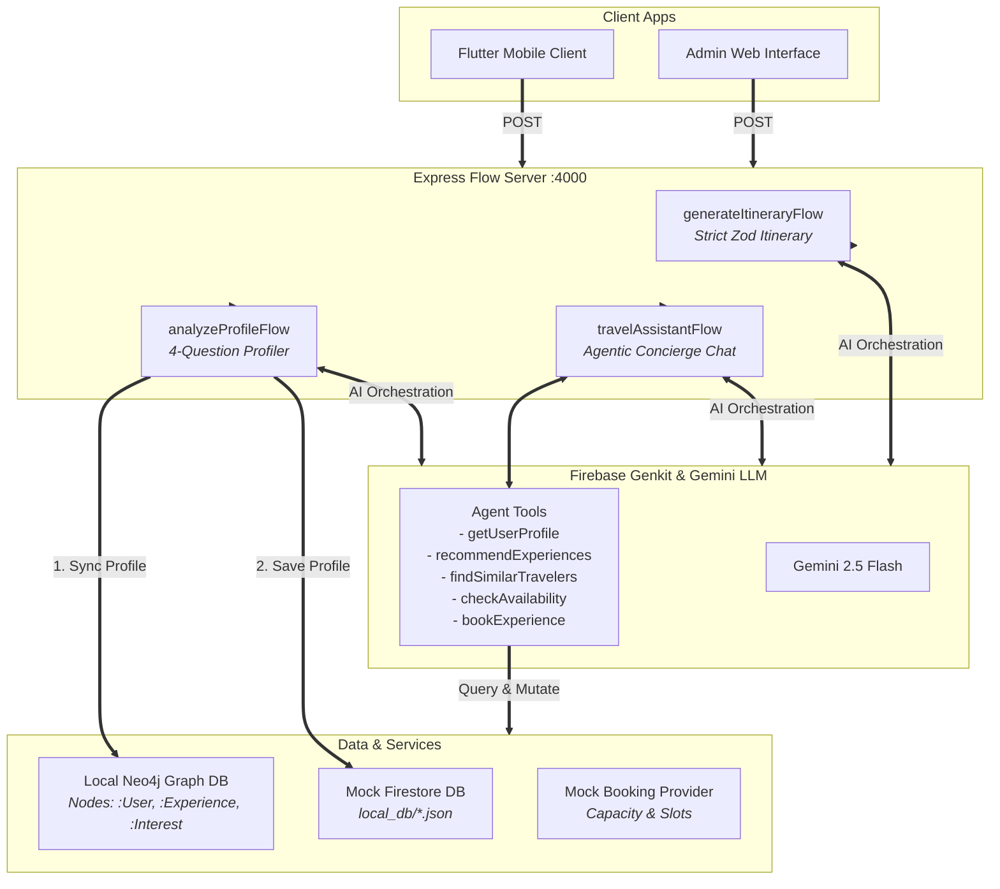

<p align="center">
  
  
  
  
  
</p>

# 🗺️ TravelAnatolia V2 — Agentic Core

> **The AI brain and autonomous agent engine behind TravelAnatolia.** A hyper-personalized travel itinerary engine powered by Firebase Genkit and Google Gemini, utilizing Neo4j graph analytics and a secure, agentic booking provider to orchestrate unforgettable journeys across Türkiye.

---

## ✨ Overview & Core Capabilities

**TravelAnatolia V2** transitions from a simple structured itinerary planner into an **active, personalized travel concierge**. Rather than just spitting out generic plans, it acts as an autonomous assistant that knows who you are, builds a global travel graph, discovers similar travel buddies on the same journey, checks live slot availability, and completes end-to-end agentic bookings.

### 🌟 Key Capabilities
1. **Interactive Traveler Onboarding**: Analyzes 4 simple onboarding answers through Gemini to extract interests, travel style, companions, and budget levels.
2. **Global Graph Integration (Neo4j)**: Synchronizes users, experiences, interests, and locations. A Cypher matching engine suggests hyper-personalized activities and links travelers on similar routes.
3. **Local File-Backed Firestore Emulator**: A lightweight JSON-file database emulator allowing offline execution and stateful testing under `local_db/`.
4. **Agentic Conversational Concierge**: A persistent multi-turn chat agent (ANA) equipped with 5 tools to fetch profiles, query graphs, check live availabilities, and make reservations.
5. **Modular Booking & Payments**: Built using decoupled provider interfaces ready for integration with real-world hotel/tour APIs and Google's latest agentic payment protocols.
6. **Graceful Self-Healing AI & Graph fallbacks**: Designed to operate flawlessly even offline or without configured API keys by engaging high-fidelity fallback simulators.

---

## 🏗️ System Architecture



---

## 📦 Tech Stack

| Layer | Technology | Purpose |
|-------|-----------|---------|
| **Runtime Engine** | Node.js 22+ / TypeScript 5.6 | Fast, strongly-typed asynchronous backend execution. |
| **AI Framework** | [Firebase Genkit](https://firebase.google.com/docs/genkit) 1.33 | Robust server flow builder, prompt manager, and multi-turn agent tool framework. |
| **LLM** | Google Gemini 2.5 Flash | High-speed, high-context generative reasoning, semantic analysis, and tool execution. |
| **Graph DB** | Neo4j Community Edition (Local Driver) | Relational interest overlapping, buddy matching, and multi-dimensional recommendation. |
| **Schema Validation** | Zod 3.x | Strict structured output verification and runtime type safety. |
| **Web Server** | Express via `@genkit-ai/express` | Mounts and exposes Genkit flows with customized CORS parameters. |
| **Database Mock** | File-backed Firestore Emulator | Stateful JSON document storage (`local_db/`) eliminating cloud dependencies for development. |

---

## 📐 Core Flows (Genkit Flow Server)

The Express server listens on port **`4000`** and exposes three main Genkit flows:

### 1️⃣ `generateItineraryFlow`
Generates a structured, multi-day, category-tagged itinerary for any natural language request.
*   **Input Schema (`ItineraryInputSchema`)**:
    ```typescript
    { userPrompt: string } // e.g. "I want a 3-day history trip to Cappadocia"
    ```
*   **Output Schema (`ItinerarySchema`)**: A strict 3-level Zod structure ensuring safe parsing for frontends:
    ```typescript
    {
      tripTitle: string,
      destination: string,
      totalDays: number,
      overview: string,
      bestTimeToVisit: string,
      packingRecommendations: string[],
      days: Array<{
        dayNumber: number,
        title: string,
        summary: string,
        pointsOfInterest: Array<{
          name: string,
          description: string,
          time: string,
          category: "history" | "nature" | "food" | "culture" | "adventure" | "relaxation",
          estimatedDurationMinutes: number,
          tips?: string
        }>
      }>
    }
    ```

### 2️⃣ `analyzeProfileFlow`
Parses the onboarding answers, builds a structured `TravelerProfile`, stores it in the local Firestore, and registers nodes/relationships in Neo4j.
*   **Input Schema (`OnboardingAnswersSchema`)**:
    ```typescript
    {
      userId: string,
      fullName: string,
      travelStyle: string,  // Favorite travel style response
      budget: string,       // Typical daily budget response
      companion: string,    // Typical travel companion response
      activities: string    // 3-5 specific activities or interests response
    }
    ```
*   **Output Schema (`TravelerProfile`)**:
    ```typescript
    {
      userId: string,
      fullName: string,
      travelStyle: "Adventure" | "History" | "Culinary" | "Relaxation" | "Other",
      budgetRange: "Budget" | "Moderate" | "Luxury",
      companion: "Solo" | "Partner" | "Family" | "Friends",
      interests: string[], // Cleaned lowercase interest tags (e.g. ["hiking", "caves"])
      personaDescription: string, // Personalized 2-3 sentence overview
      createdAt: string
    }
    ```

### 3️⃣ `travelAssistantFlow`
A persistent conversational agent interface utilizing Gemini tool-calling to recommend tours, discover buddies, check slot capacities, and book excursions.
*   **Input Schema (`ChatInputSchema`)**:
    ```typescript
    {
      userId: string,
      sessionId: string,
      message: string
    }
    ```
*   **Output Schema (`ChatOutputSchema`)**:
    ```typescript
    {
      responseMessage: string,      // Rich textual reply from the agent (ANA)
      chatHistory: ChatMessage[]    // Full, updated chat logs (roles: "user", "model", "tool")
    }
    ```

---

## 🕸️ Neo4j Graph Schema & Smart Matching Engine

To connect travelers on similar journeys and suggest personalized items, TravelAnatolia utilizes an interlocking Neo4j graph model:

### Graph Schema Layout
*   **Nodes**:
    *   `(:User {userId, fullName, travelStyle, budgetRange})`
    *   `(:Experience {id, name, category, location, priceUSD})`
    *   `(:Interest {name})` (Shared lowercase tag nodes, e.g. `"hiking"`, `"fine-dining"`, `"caves"`)
    *   `(:Location {name})` (Geographic reference, e.g. `"Göreme"`, `"Cappadocia"`)
*   **Relationships**:
    *   `(:User)-[:HAS_INTEREST]->(:Interest)`
    *   `(:Experience)-[:HAS_TAG]->(:Interest)`
    *   `(:Experience)-[:LOCATED_IN]->(:Location)`

```
  (:User) --------[:HAS_INTEREST]--------> (:Interest) <--------[:HAS_TAG]-------- (:Experience)
                             \                                     /
                    [:LOCATED_IN]                           [:LOCATED_IN]
                             v                                     v
                                       (:Location)
```

### 🔮 Personalized Recommendations (Cypher)
To retrieve experiences that share the highest number of overlapping interest tags with the traveler:
```cypher
MATCH (u:User {userId: $userId})-[:HAS_INTEREST]->(i:Interest)<-[:HAS_TAG]-(e:Experience)
RETURN e.id AS id, e.name AS name, e.category AS category, e.location AS location, e.priceUSD AS priceUSD, count(i) AS score
ORDER BY score DESC, e.priceUSD DESC
LIMIT 5
```

### 🤝 Social Companion Finder (Cypher)
To locate other travelers on similar journeys who share 2 or more interests and have compatible travel styles:
```cypher
MATCH (u:User {userId: $userId})-[:HAS_INTEREST]->(i:Interest)<-[:HAS_INTEREST]->(other:User)
WHERE u.userId <> other.userId
WITH other, count(i) AS sharedCount, collect(i.name) AS sharedInterests
WHERE sharedCount >= 2
RETURN other.userId AS userId, other.fullName AS fullName, other.travelStyle AS travelStyle, sharedCount, sharedInterests
ORDER BY sharedCount DESC
LIMIT 5
```

---

## 🛠️ Resilient Local-First Features

### 📁 File-Backed Mock Firestore
Testing database setups in development is seamless. If no live Firestore is initialized, the system automatically uses [src/firestoreMock.ts](file:///c:/Users/ASUS/Desktop/travelanatolia/Agentic-Core/src/firestoreMock.ts). 
*   Persists data in human-readable JSON files inside the **`local_db/`** directory.
*   Separated collections for:
    *   `local_db/profiles.json` (Traveler Profiles)
    *   `local_db/experiences.json` (Available Experiences Catalog)
    *   `local_db/sessions.json` (Conversational Chat Histories)
    *   `local_db/bookings.json` (Completed Reservations)

### 🧩 Plug-and-Play Reservation Interface
The system isolates tour and booking boundaries inside [src/mockProvider.ts](file:///c:/Users/ASUS/Desktop/travelanatolia/Agentic-Core/src/mockProvider.ts).
*   Enforces double-booking prevention by maintaining local availability pools.
*   Keeps payment and reservation logic strictly encapsulated, ready to drop in third-party API drivers or Google Agentic Payment protocols.

### 🩹 Self-Healing Mock AI Mode
If your environment lacks `GOOGLE_GENAI_API_KEY`, the core doesn't break. 
*   Onboarding and Chat flows automatically catch key-missing errors, logging `⚠️ [Mock AI Mode]` warnings.
*   Serves high-fidelity simulated profile parsing and smart agent tool dialogues programmatically.
*   Enables 100% green local validation runs for offline environments or frontend designers without API key access.

---

## 🚀 Quick Start Guide

### 1. Prerequisites
*   **Node.js** (v22 or higher recommended)
*   **Docker** (to run local Neo4j in a single line)

### 2. Clone & Install
```bash
# Clone the repository
git clone https://github.com/erdometo/travelanatolia-core.git
cd travelanatolia-core

# Install all dependencies
npm install
```

### 3. Spin up local Neo4j
Launch a configured Neo4j instance using Docker:
```bash
docker run -d \
  --name neo4j-travel \
  -p 7474:7474 -p 7687:7687 \
  -e NEO4J_AUTH=neo4j/password123 \
  neo4j:latest
```
*   *Note: If you skip running Neo4j, the system will log a warning during startup and sync operations but will continue execution using mock database engines.*

### 4. Configure Environment
Create a `.env` file at the root:
```env
# Optional: Google AI Studio API Key (Leave empty to trigger self-healing Mock AI Mode)
GOOGLE_GENAI_API_KEY="your_api_key_here"

# Neo4j Database Details
NEO4J_URI="bolt://localhost:7687"
NEO4J_USER="neo4j"
NEO4J_PASSWORD="password123"
```

### 5. Seed Catalog & Users
Populate the mock Firestore database and local Neo4j with beautiful Cappadocia tours and traveler profiles:
```bash
npx tsx src/seed.ts
```

### 6. Run the Developer UI
Start Firebase Genkit developer interface:
```bash
npm run dev
```
Genkit Developer UI launches at **http://localhost:4000** where you can test all flow inputs and review trace outputs.

### 7. Run End-to-End Test Suite
To run a complete programmatic simulation of database seeding, profile onboarding, Neo4j graph matches, chat sessions, availability validation, and reservation booking, run:
```bash
npx tsx src/verify.ts
```

---

## 🧪 API Verification & Integration

### Onboarding Profiler via cURL
Submit onboarding responses to create a traveler profile and sync with Neo4j:
```bash
curl -X POST http://localhost:4000/analyzeProfileFlow \
  -H "Content-Type: application/json" \
  -d '{
    "data": {
      "userId": "user_david",
      "fullName": "David Beckham",
      "travelStyle": "Active hiking, ballooning, premium dining",
      "budget": "High luxury budget",
      "companion": "Solo traveler",
      "activities": "hiking, ballooning, fine dining, history"
    }
  }'
```

### Chat Concierge (ANA) via cURL
Interact with the persistent conversational concierge:
```bash
curl -X POST http://localhost:4000/travelAssistantFlow \
  -H "Content-Type: application/json" \
  -d '{
    "data": {
      "userId": "user_david",
      "sessionId": "session_12345",
      "message": "Hi ANA! Can you recommend some activities matching my profile?"
    }
  }'
```

---

## 📁 File Structure

```
Agentic-Core/
├── local_db/              # File-backed database JSONs (git-ignored)
│   ├── profiles.json      # Onboarded traveler profiles
│   ├── experiences.json   # Pluggable experience catalog
│   ├── sessions.json      # Persistent multi-turn chat sessions
│   └── bookings.json      # Logged booking reservations
├── src/
│   ├── index.ts           # Flow Server setup & original Itinerary schemas
│   ├── ai.ts              # Central Firebase Genkit instance & mock check
│   ├── types.ts           # System interfaces & Zod objects
│   ├── firestoreMock.ts   # File-backed local document manager
│   ├── neo4j.ts           # Neo4j Driver client connection
│   ├── graphSync.ts       # Cypher synchronization maps (:User, :Experience)
│   ├── graphQueries.ts    # Cypher recommendation & social matching logic
│   ├── onboarding.ts      # Profile parsing Genkit flow
│   ├── mockProvider.ts    # Seat capacity manager & reservation staging
│   ├── agent.ts           # Multi-turn chat assistant flow & tool registry
│   ├── seed.ts            # Experience & traveler catalog seeder
│   └── verify.ts          # End-to-end programmatic verification suite
├── package.json           # Node scripts & dependencies
├── tsconfig.json          # TypeScript compilation configuration
├── .env.example           # Environment variables template
├── .gitignore             # Git ignored patterns (local_db, lib)
└── README.md              # Project documentation
```

---

## 🗺️ Roadmap

- [x] Hyper-personalized onboarding flow utilizing Gemini structure parsing
- [x] Multi-dimensional personalization engine via local Neo4j graph driver
- [x] Modular capacity-controlled booking provider architecture
- [x] Multi-turn persistent agent chat (ANA) with tool execution binds
- [x] Self-healing offline mock database and mock AI resilience
- [ ] Migrate Mock Firestore to live Google Cloud Firestore/Data Connect
- [ ] Enable Firebase Authentication tokens injection in Flow headers
- [ ] Implement multi-agent sub-coordinators (TransportAgent, FlightAgent)
- [ ] Connect Google Agentic Payment protocols to physical bank APIs
- [ ] Implement responsive UI clients (Flutter mobile client & Vite web client)

---

<p align="center">
  Built with 🧡 for TravelAnatolia V2
</p>
